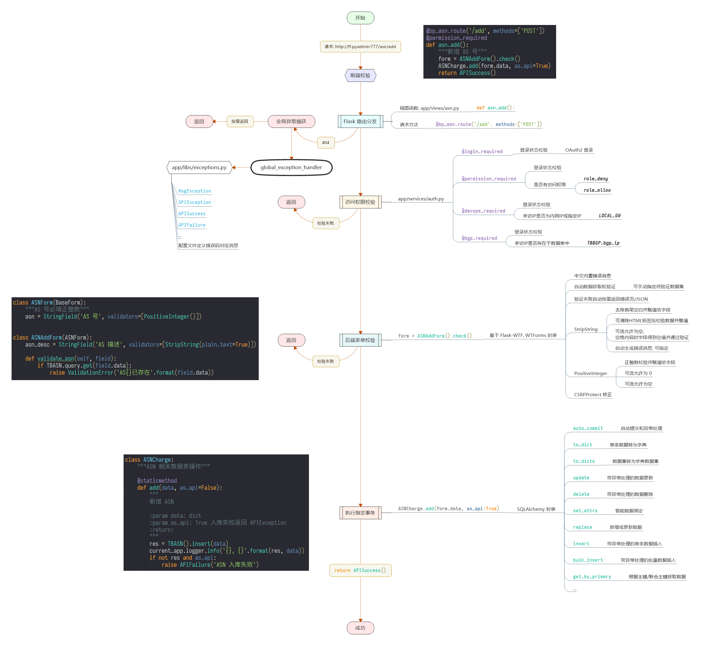
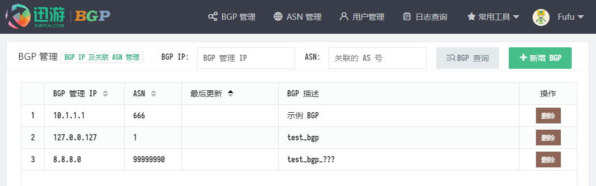

# FF.PyAdmin (接口服务/后台管理微框架)

## 初衷

运维开发中, 各类接口服务和后台管理系统必不可少, 索性写个通用的/简单易用的/支持快速开发的微框架.

一是开发时尽可能只关注业务逻辑, 快速实现, 不用再过多考虑架构/前端/布局什么的.

二是将常用业务逻辑二次封装, 使用时, 用简洁的语句即可完成复杂的事务, 并自动处理异常.

三是方便运维小伙伴们快速理解 Web 项目开发, 无须深入理解 Flask 和前端即可完成此类项目开发.

## 特点

1. 后端 Flask, 对异常处理, 数据库, 表单验证, 权限验证都做了二次封装, 调用更简单, 通用性强.
2. 前端 LayUI, 对数据表格作了二次封装, 支持自动按数据表生成表头, 可选使用. 丰富配色, 丰富图标.
3. 前后端完全使用 API 接口通信, JSON 数据交互. 方便与各类前端框架/小程序对接.
4. 适合做纯 API 接口服务, 也适合同时做接口服务和后台管理, 应用广泛/灵活.
5. 对 HTTP 异常二次封装, APIException/MsgException, 标准化 JSON 字段和错误消息页面.
6. 实现全局异常处理, 支持配置中自定义 404 等状态码消息. 500 状态码时自动记录日志.
7. 异常返回自适应, POST 和 AJAX 请求自动返回JSON数据, 其他状态展示自定义错误页, DEBUG 显示原始异常.
8. 自定义常用权限校验装饰器, 登录验证, 菜单权限验证, 接口权限验证, 来访 IP 白名单等.
9. 依托 Flask 蓝图和视图函数, 适应大部分情况下的权限管理需求. 扩展性强.
10. WTForms 二次封装, 极简调用, 适应性强. 中文内置错误消息, 自动数据获取的验证.
11. 验证失败自动按需返回 JSON 或错误页. 自定义了通用的字符串和正整数验证方法, 适用性广.
12. 修正 Flask-wtf 0.14.2, @csrf.exempt 无效的问题.
13. SQLAlchemy 数据库交互二次封装, 实现自动提交机制和完善的异常处理, CRUD 全封装, 极简调用.
14. 自带文件日志, 按日志文件大小自动滚动, 无须配置.
15. 安全, 方便, 完善的配置文件方案.

## 图示





## 依赖

1. Flask==1.1.1
2. Flask_Login==0.4.1
3. Flask_WTF==0.14.2
4. Flask_Script==2.0.6
5. Flask_Migrate==2.5.2
6. Flask_SQLAlchemy==2.4.0
7. SQLAlchemy==1.3.11
8. cymysql==0.9.14
9. WTForms==2.2.1
10. Authlib==0.13
11. requests==2.22.0
12. concurrent_log_handler==0.9.16
13. xxtea==1.3.0
14. behave==1.2.6

该框架基于公司内部 OA 系统 OAuth2 登录, 在登录画面点击即可进入演示后台. 需要自行准备 OAuth2 参数配置到配置文件, 如 QQ, 微信, GitHub, 钉钉等. 也可自行实现账号密码登录.

```python
# app/views/web.py
@bp_web.route('/authorize')
def web_authorize():
    """OAuth 登录跳转"""
    # TODO: (演示使用, 自动登录), 请删除并配置自己的认证方式, OAuth2或账密系统
    set_user_login({
        'job_number': 7777,
        'realname': 'Fufu'
    })
    return redirect(url_for('web.web_index'))
```


## 结构

    .
    ├── app  应用根目录, app.root_path
    │   ├── conf  配置文件目录
    │   ├── forms  表单验证
    │   ├── libs  公共类库
    │   ├── models  表模型
    │   ├── services  中间件, 逻辑处理
    │   ├── static  静态文件
    │   ├── templates  模板文件
    │   └── views  视图函数
    ├── data  数据文件
    ├── docs  开发文档
    ├── features  BDD
    │   └── steps
    ├── logs  日志目录
    │   └── behave.reports
    ├── scripts  脚本
    ├── tests  单元测试
    ├── tmp  临时文件
    └── venv  虚拟环境

## 配置

1. `secret_settings.py` 必须, 一般设置 SECRET_KEY 及数据库配置, 不要加入 Git.
2. `settings.py` 必须, 常规配置, APP_NAME, 日志参数, 错误消息等.
3. `production_settings.py` 可选, 默认加载项, 生产环境额外配置.
4. `development_settings.py` 可选, 开发环境额外配置.
5. `testing_settings.py` 可选, 测试环境额外配置, BDD 或单元测试时使用.

第 3/4/5 项需要设置环境变量, 默认为 `production`, 可选: `development` `testing`. 如:

```shell
# 1. Windows:
	set FF_PyAdmin=development
	echo %FF_PyAdmin%
# 2. Linux:
	export FF_PyAdmin=development
	echo $FF_PyAdmin
```

生产环境建议使用加密环境变量, 生成加密数据的方式如下:

```shell
# Fufu~~Text 加密后 792e01268cc350077f772a5f
python3 manage.py encrypt -d Fufu~~Text
```

使用方法见 `secret_settings.py` 中 `OA_CLIENT_SECRET` 和 `PYADMIN_DBPASS`, 配置示例:

```shell
# Linux (Windows 使用上面的 set 方法)
cp scripts/etc-profile.d-ffpyadmin.sh /etc/profile.d/ffpyadmin.sh
chmod +x /etc/profile.d/ffpyadmin.sh
source /etc/profile.d/ffpyadmin.sh
```

也可以使用不加密的环境变量, 配置文件中的获取环境变量时不加 key 参数即可:

```python
# OA_CLIENT_SECRET = get_environ('PYADMIN_OAUTH_SECRET', key=SECRET_KEY)
OA_CLIENT_SECRET = get_environ('PYADMIN_OAUTH_SECRET')
```

## 使用

1. Python3.5+, pip, MySQL 环境
2. 建好 MySQL 数据库, 导入 data/db_ff_pyadmin.sql 示例数据, 修改配置文件
3. pip3 install -r requirements.txt
4. python3 start.py
5. 访问: http://127.0.0.1:5000  [http://ff.pyadmin:777](http://ff.pyadmin:777/)

## 资料

- Flask https://github.com/pallets/flask
- OAuth2 https://github.com/lepture/authlib
- LayUI https://github.com/sentsin/layui